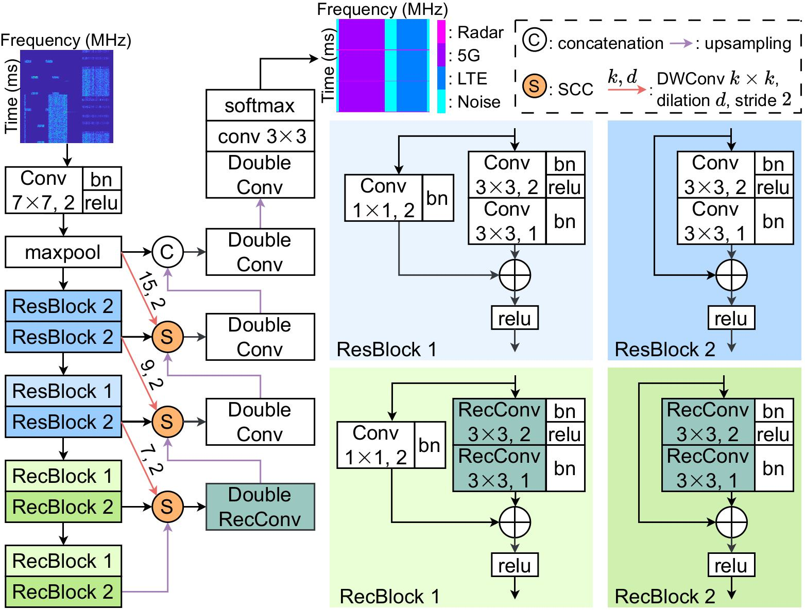

# RecSpecUNet: A Recycled and Selective Architecture for Efficient Spectrogram Segmentation

Automatic signal identification in time–frequency spectrograms plays a vital role in next-generation wireless communications, where multiple technologies such as 5G, LTE, and radar coexist in dynamic spectral environments. Achieving accurate and real-time spectrum sensing on resource-constrained platforms like IoT devices and small-cell base stations remains a significant challenge due to the high complexity and redundancy of existing deep models.

To address these challenges, RecSpecUNet is proposed, a lightweight UNet-based segmentation model that enhances both accuracy and efficiency through two main innovations: the Recycled Convolution for reducing redundancy and model size via kernel reuse, and the Selective Channel Concatenation for strengthening global–spatial feature fusion and robustness under noisy conditions.

Comprehensive experiments demonstrate that RecSpecUNet achieves a strong balance between performance and efficiency, reaching 98.7% mean accuracy and 95.8% mean IoU with only 2.6M parameters and 1.9 ms inference time, outperforming or matching several state-of-the-art models such as UNet, UNet++, DeepLabV3+, DPSegNet, and SRNet. In particular, RecSpecUNet reduces parameters by 81.8% and GFLOPs by 25.5% compared to the baseline UNet, making it an ideal choice for real-time signal segmentation on mobile and embedded devices.

The dataset can be download on [Google Drive](https://drive.google.com/file/d/1tw2Vu9sa8F5DpKSNm1jWxhkMWZWUJuTB/view?usp=sharing) (please report if not available).

If there are any errors or topics that need to be discussed, please contact [Phuc-Thinh Huynh](https://github.com/PhucThinhHuynh) via email at huynhphucthinh51@gmail.com.
